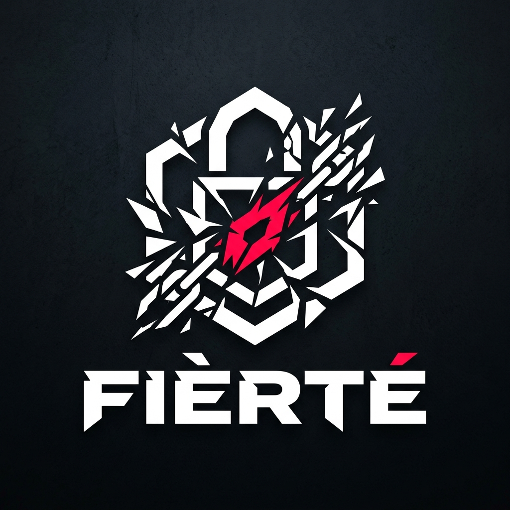

<div align="center">



# FIÈRTÉ

### *No excuses. No participation trophies. Only output.*

[](https://fierte-v1.vercel.app)
[](https://render.com)
[](https://ai.google.dev)

---

**Fièrté** is an AI-powered habit tracker that doesn't believe in your excuses.  
Inspired by *Blue Lock's* ruthless, ego-first philosophy — it negotiates your habits,  
tracks them with cold precision, and **destroys you when you fail.**

[Get Started](#-the-ritual) · [How It Works](#-how-it-works) · [Architecture](#-architecture) · [Deploy Your Own](#-deployment)

</div>

---

## 🩸 The Philosophy

Most habit trackers congratulate you for breathing. Fièrté doesn't.

It operates on three principles:

> **1. You don't choose easy habits.** The AI negotiates them for you — measurable, daily, brutal.  
> **2. You are watched.** Every night at 11:59 PM, an AI evaluates your performance and delivers a verdict.  
> **3. You are punished or promoted.** Fail, and you get roasted. Succeed for 7 days straight, and your targets increase.

There are no badges. No streaks with fireworks. Just a heatmap that shows exactly who you are.

---

## ⚡ How It Works

### Phase 1 — The Contract

```
You → "I want to get shredded and ship more code"
AI  → "Here's your contract. 150 push-ups. 2 hours deep work. 30 minutes reading. Daily. No exceptions."
You → Accept or renegotiate (but the AI won't go easy)
```

During onboarding, you tell the AI your goals in plain language. It connects via **WebSocket**, analyzes your ambitions, and returns 3-4 concrete daily habits — specific, measurable, and uncomfortable. You can renegotiate, but the AI is not your friend.

Once you accept: **CONTRACT SEALED.** No going back.

### Phase 2 — The Arena

Your dashboard. One card per habit. Each card shows:

- 📊 **365-day heatmap** — GitHub-style contribution grid. Green = completed. Red = failed. Dark = no data.
- 🔥 **Streak counter** — Current consecutive days + personal best
- 📈 **Performance stats** — Completion rate with progress bar
- ⚙️ **Difficulty badge** — Shows your current level and any overload multiplier

Hit **"LOG TODAY"**, enter your value, and the system decides if you met the target.

### Phase 3 — The Judgment

Every night at **23:59 UTC**, the nightly worker wakes up:

```
┌─────────────────────────────────────────┐
│  For each user:                         │
│  1. Fetch today's habit logs            │
│  2. Calculate completion rate           │
│  3. Determine verdict:                  │
│     • 100% → PERFECT (cold approval)    │
│     • ≥50% → PASS (neutral, joyless)    │
│     • <50% → FAIL (savage roast)        │
│  4. Save evaluation to database         │
│  5. Send email with the AI's verdict    │
└─────────────────────────────────────────┘
```

The AI's evaluation messages are:
- **FAIL**: *"You logged 40 push-ups against a target of 150. That's not a bad day — that's a choice to be mediocre."*
- **PASS**: *"You completed 3 of 4 habits. Noted. The gap is still a gap."*
- **PERFECT**: *"You met the standard. Don't expect applause. The standard is the minimum."*

### Phase 4 — Progressive Overload

Hit **PERFECT for 7 consecutive days**? Your reward isn't a trophy — it's a **10% increase** in your targets.

```
Level 1: 150 push-ups → Level 2: 165 push-ups → Level 3: 182 push-ups → ...
```

The multiplier stacks. The difficulty badge on your card updates to show `+10% OVERLOAD`, `+21% OVERLOAD`, etc. You asked to get better. This is what better looks like.

### Phase 5 — The Locker Room

A history of every nightly verdict. Scrollable. Unflinching.

Each evaluation card shows the date, verdict badge (color-coded), completion rate bar, and the raw AI message. It's a mirror — *"What happened when you thought no one was watching."*

---

## 🏗 Architecture

```
┌─────────────────────────────────────────────────────────────┐
│                        FRONTEND                             │
│              Next.js 14 · App Router · Vercel               │
│                                                             │
│  ┌──────────┐  ┌──────────┐  ┌──────────┐  ┌────────────┐  │
│  │ Landing  │  │Onboarding│  │  Arena   │  │Locker Room │  │
│  │  Page    │  │(WebSocket│  │(Dashboard│  │(Evaluation │  │
│  │          │  │ + AI)    │  │ + Heatmap│  │  History)   │  │
│  └──────────┘  └──────────┘  └──────────┘  └────────────┘  │
│                                                             │
│  TypeScript · Tailwind CSS · Framer Motion · React Query    │
└─────────────────────────┬───────────────────────────────────┘
                          │ REST + WebSocket
┌─────────────────────────▼───────────────────────────────────┐
│                        BACKEND                              │
│             FastAPI · Python 3.11 · Render                  │
│                                                             │
│  ┌──────────┐  ┌──────────┐  ┌──────────┐  ┌────────────┐  │
│  │Auth + JWT│  │  Habits  │  │ Heatmap  │  │  Nightly   │  │
│  │          │  │  CRUD +  │  │ (Cached) │  │  Worker    │  │
│  │          │  │  Logging │  │          │  │ (23:59 UTC)│  │
│  └──────────┘  └──────────┘  └──────────┘  └────────────┘  │
│                                                             │
│  SQLAlchemy 2.0 · Alembic · APScheduler · LangChain        │
└────────┬────────────────────────────┬───────────────────────┘
         │                            │
    ┌────▼────┐                  ┌────▼────┐
    │Supabase │                  │ Upstash │
    │PostgreSQL│                  │  Redis  │
    │         │                  │ (Cache) │
    └─────────┘                  └─────────┘
```

### Key Patterns

| Pattern | Where | How |
|---|---|---|
| **Cache-Aside** | Heatmap + Streak data | Redis caches heatmap JSON (TTL: 1hr). Invalidated on every habit log. |
| **WebSocket Negotiation** | Onboarding | Real-time AI conversation to establish habit contract. Token auth via query param. |
| **Nightly Cron** | APScheduler | Runs at 23:59 UTC. Error-isolated per user — one failure doesn't abort the batch. |
| **Progressive Overload** | AI Service | 10% difficulty increase after 7 consecutive PERFECT days. Compounds infinitely. |
| **JWT Auth** | All routes | HS256 tokens, 7-day expiry, stored in `localStorage`. Auto-redirect on 401. |

---

## 🛠 Tech Stack

| Layer | Technologies |
|---|---|
| **Frontend** | Next.js 14 (App Router) · TypeScript · Tailwind CSS · Framer Motion · React Query · Zustand |
| **Backend** | FastAPI · Python 3.11 · SQLAlchemy 2.0 (Async) · Alembic · Pydantic v2 · APScheduler |
| **AI** | LangChain · Google Gemini 1.5 Flash |
| **Database** | Supabase (PostgreSQL) |
| **Cache** | Upstash (Redis) |
| **Email** | Resend |
| **Hosting** | Vercel (Frontend) · Render (Backend) |
| **CI/CD** | GitHub Actions |

---

## 🚀 The Ritual

### Prerequisites

- Docker & Docker Compose
- [Gemini API Key](https://ai.google.dev)
- [Resend API Key](https://resend.com) (for nightly emails)

### Local Setup

```bash
# 1. Clone
git clone https://github.com/r-Shivansh01/Fierte_v1.git
cd Fierte_v1

# 2. Configure environment
cp backend/.env.example backend/.env
cp frontend/.env.local.example frontend/.env.local
# Fill in your API keys and database URLs

# 3. Launch
docker-compose up --build

# 4. Run migrations
docker-compose exec backend alembic upgrade head
```

Frontend: `http://localhost:3000`  
Backend: `http://localhost:8000`  
API Docs: `http://localhost:8000/docs`

---

## 🌐 Deployment

### Backend → Render

1. Create a **Web Service** on [Render](https://render.com)
2. Connect the repository · Set root directory to `backend`
3. **Build:** `pip install -r requirements.txt`
4. **Start:** `uvicorn app.main:app --host 0.0.0.0 --port $PORT`
5. Add all env vars from `backend/.env.example`

### Frontend → Vercel

1. Create a new project on [Vercel](https://vercel.com)
2. Connect the repository · Set root directory to `frontend`
3. Framework preset: **Next.js**
4. Add environment variables:

| Variable | Value |
|---|---|
| `NEXT_PUBLIC_API_URL` | Your Render backend URL |
| `NEXT_PUBLIC_WS_URL` | `wss://your-render-url` |
| `NEXTAUTH_URL` | Your Vercel frontend URL |
| `NEXTAUTH_SECRET` | Random 32+ character string |

### Database Migrations (Production)

```bash
# Point DATABASE_URL to your production Supabase instance
cd backend
alembic upgrade head
```

---

## 📂 Project Structure

```
fièrté/
├── frontend/                   # Next.js 14 App
│   ├── app/
│   │   ├── page.tsx            # Landing page (brutalist, typography-driven)
│   │   ├── (auth)/             # Login + Register
│   │   ├── onboarding/         # AI habit negotiation (WebSocket)
│   │   └── dashboard/
│   │       ├── page.tsx        # Arena — habit cards + heatmaps
│   │       ├── locker-room/    # Nightly AI evaluation history
│   │       └── settings/       # Contract management
│   ├── components/
│   │   ├── dashboard/          # HabitCard, HeatmapGrid, StreakCounter, etc.
│   │   └── locker-room/        # EvaluationCard, RoastDisplay
│   └── lib/                    # API client, hooks, store, types
│
├── backend/                    # FastAPI App
│   └── app/
│       ├── routers/            # auth, habits, heatmap, evaluations, ws
│       ├── services/           # AI, auth, cache, email, habit logic
│       ├── workers/            # Nightly cron job
│       └── models/             # User, Habit, HabitLog, Evaluation
│
└── docker-compose.yml          # Local dev orchestration
```

---

<div align="center">

### The contract is signed. The heatmap doesn't lie.

*Built with spite, discipline, and an unreasonable amount of Gemini API calls.*

**© FIÈRTÉ** — No excuses.

</div>
